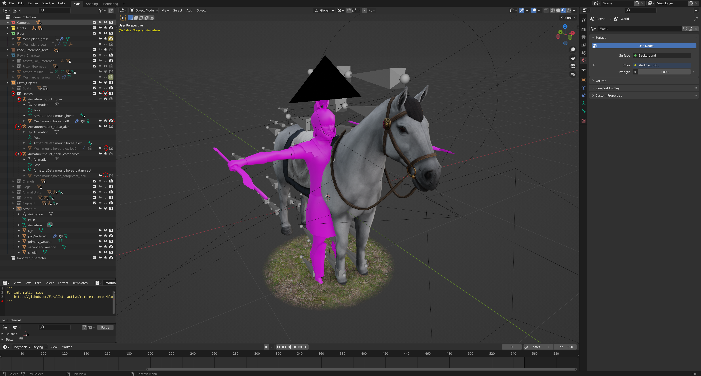
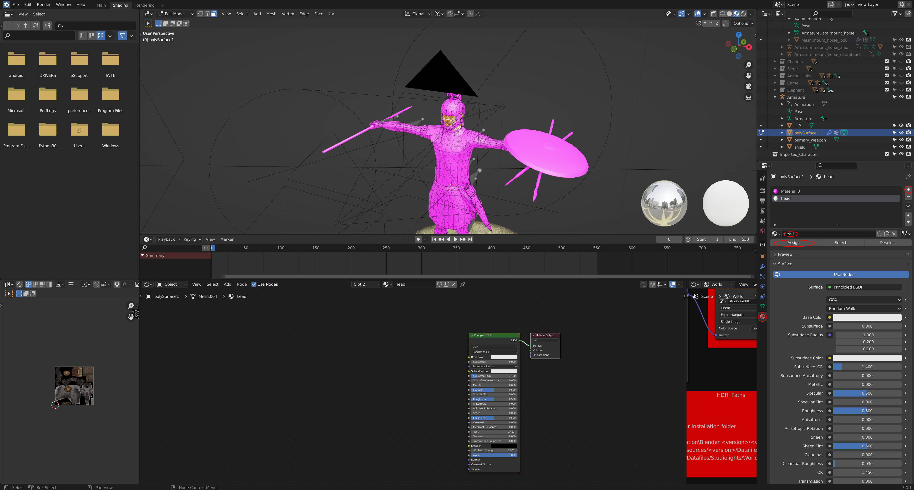
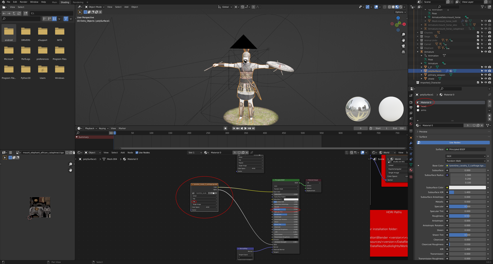
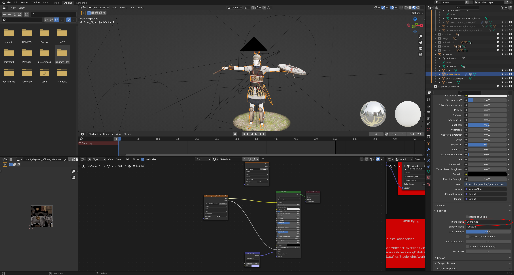
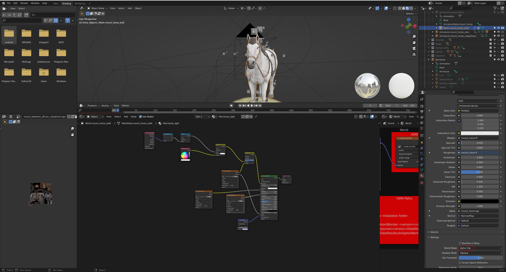
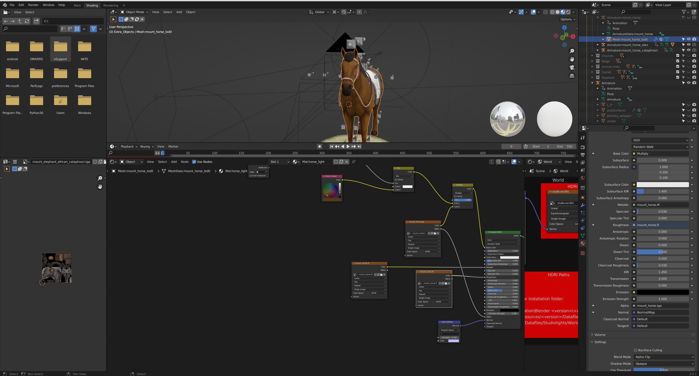
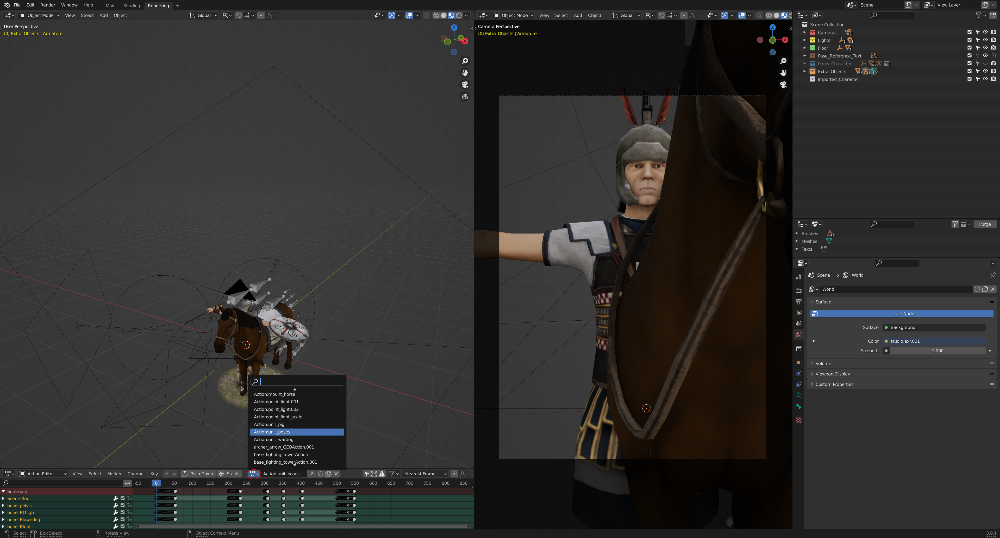

## Creator: **Eduardo** <!-- omit from toc -->

---

# A Guide to Rome Remastered Unit-Card Making <!-- omit from toc -->

This guide will teach you how to make unit cards for Total War Rome: Remastered in Blender using Feral's unit card template.

For reference, in this guide's folder you can find the model and texture as well as the blend scene I used as an example.

First of all, make sure you have downloaded the GitHub repository of the Feral template (https://github.com/FeralInteractive/romeremastered-unitcards), as well as the CasPacker tool found on the main Rome Remastered repository (https://github.com/FeralInteractive/romeremastered/tree/main).

Once that is done, place the cas_to_fbx_all.bat file found in this guide's folder in the same folder where you have casconv.exe, and copy your lod0 models to the same folder. You can then run the .bat file and your models in fbx format should appear in the same directory.

Now, open TWRR_portrait_render_scene.blend found in `romeremastered-unitcards > TWRR_portrait_render_blender`.
Import your fbx model. It will appear very small, so you should resize it x100. The model should be selected, so all you have to do is press `s` and then write 100 and `Enter`.

Now we need to add the remaining objects that should be in the scene. In the case of archers this means the arrow, in case of cavalry the horse (and the arrow if it's horse archers). There are also artillery, chariot and elephant models if necessary in the template.

I'm doing a cavalry unit so I'm going to set the horse to visible. To do this, I will click the eye icon to the right of the Horses section, then expand it as well as the armatures under it, and in each horse mesh, if I'm not using it I'll also hide, if I am using it I'll click on the camera icon to set it as active when the image is rendered:

So we now have the soldier and horse models, but they don't have the correct textures. We should now go over to the Shading tab.
For clarity in the next steps, whenever I mention hiding or showing a mesh it means clicking the eye icon for that mesh (like we did earlier for the horse).

I'll now hide the horse while texturing the soldier since it is in the way.
I will also delete my secondary weapon mesh from the soldier since it should not appear.

Since the soldier has many textures that need to be applied (head, hair, facial hair, torso, arms and legs, though not all are necessary for every model, in this case I'll just use head, arms and legs), you'll need to divide its mesh in various materials. To do this, select the mesh and go into Edit Mode.

Select all the faces of the head (select one and use `Ctrl` + `+` on the numpad to get the rest). Now you need to go over to Material Properties, click Add Material Slot, then New, then rename your material to whatever you want (but you should probably name it something recognizable), and finally click assign:

I will now do the same for the arms, legs, hands and feet. These have a single texture for all of them so I can have them all under the same material. I will then return to Object Mode.

Now after selecting Material 0 on the right-hand side of the screen, I'll drag and drop my model's texture to the lower part of the screen and connect it up to Principled BDFS as shown, as well as selecting Clip instead of Extend in one of the texture options. I will also reduce Specular to 0 on Principled BDSF.

Then in the right-hand pannel I will scroll down until i see `Settings > Blend Mode` which I will set to Alpha Clip.

I will now do the same for the head and arms materials, of course with the correct textures. You can find the skin textures used by the game in `romeremastered-unitcards-main\TWRR_portrait_render_blender\textures\TTWR\characters\body-part\albedo_classic`. The arms and legs texture is combined with the torso texture - you will need to separate them in an image editor to get 2 separate ones.

I will now hide the soldier and show the horse in order to correct the horse's texture.

This is how the texturing for the horse is set up by default:

The first thing to do is to again change Blend Mode to Alpha clip.

Then, we can drag and drop the correct horse texture to replacethe default one. In this case I don't need to do this since the default one is Carthage's and I'm making this card for them, but after dragging and dropping another texture all you'd need to do is connect it like the default mount_horse.tga is as well as set the same settings in your texture.

You can then use the color box to set the horse to another color - usually some scale of grey or brown, though I guess if you're making a disco mod you can have bright yellow and green horses.

Now show the soldier again, select its armature, and head over to the Rendering tab.
Choose Action:unit_poses in the highlighted place in the following image:

You can now use the left and right arrows to scroll through the poses until you find one you like. Then, you can click Render and Render Image to get your unit card.

Save that image. Then expand the Cameras section, and select the full render camera for the info image, and again render the image and save it.

You now have your unit and info cards!

You'll need to convert them to tga for the game to recognize them, and you should also resize them to the correct sizes.
I like to use the Vibrance option in Photoshop to add some because I think vanilla images are slightly more vibrant, but this is not necessary.

If you are going to do many versions of the same card for many different factions, I suggest saving the final blend scene so you don't have to redo the whole process. This way you'll only need to set up the relevant textures again while keeping everything else the same.

Have fun with your new unit cards!