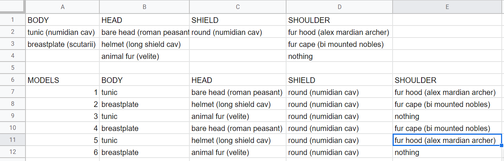
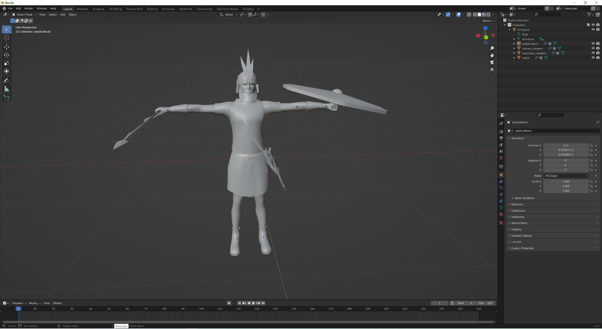
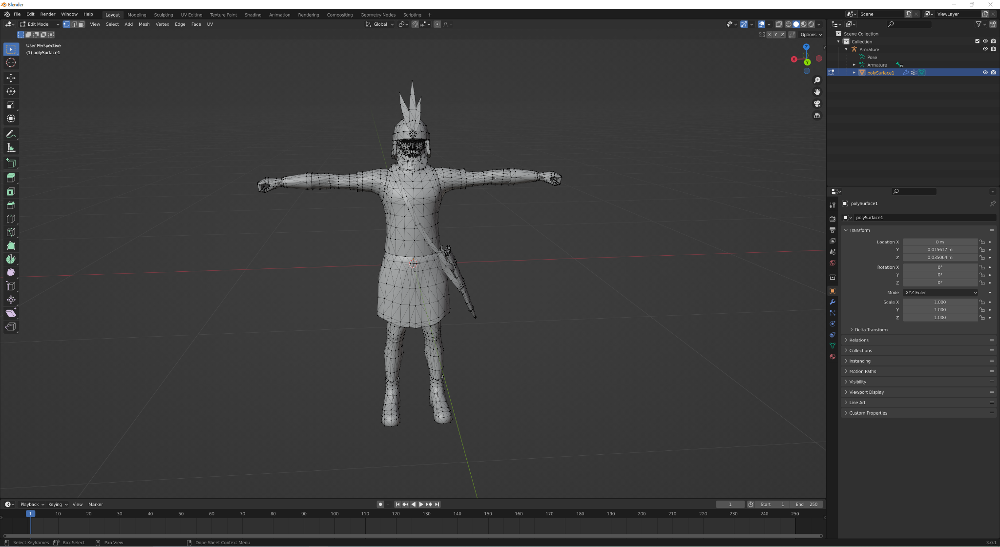
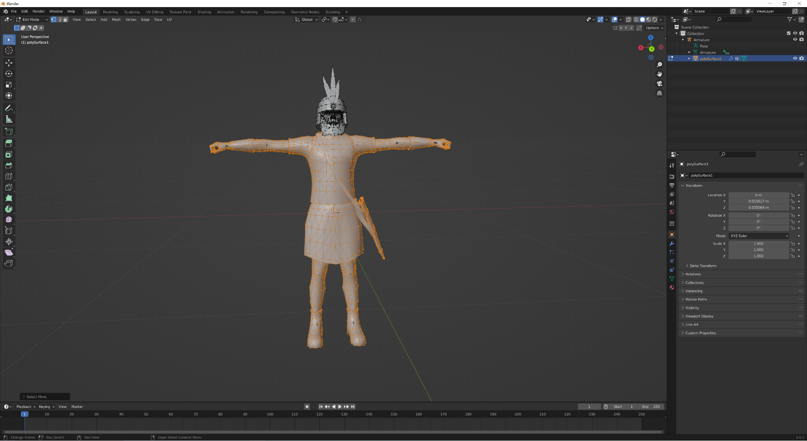
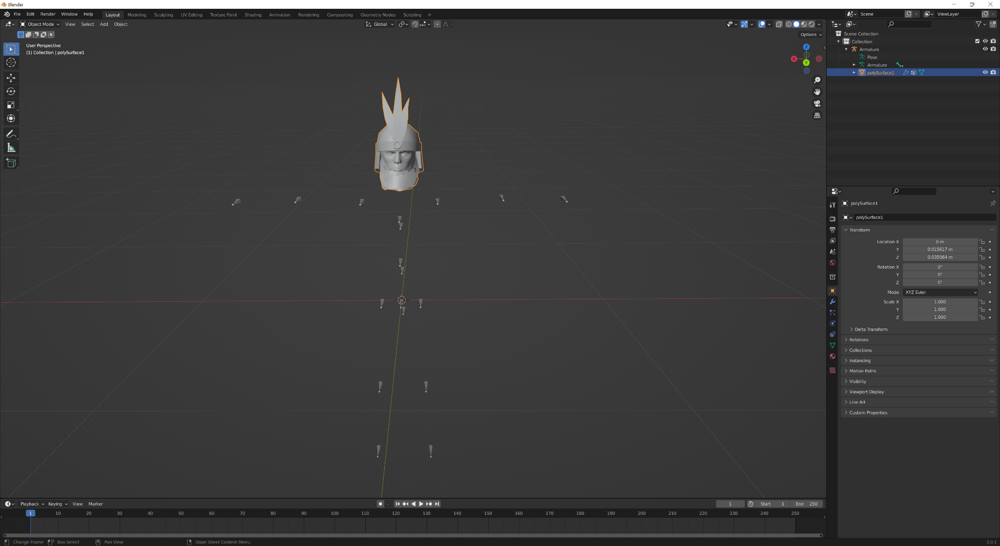
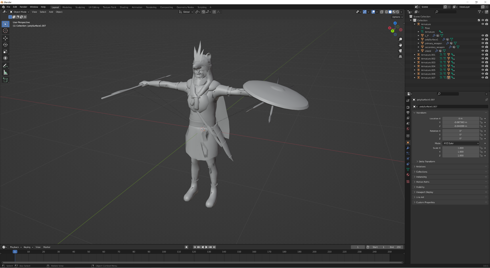
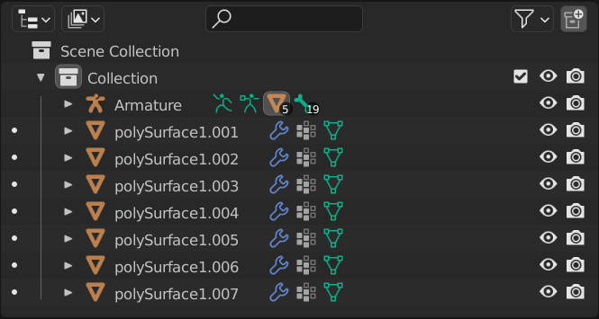
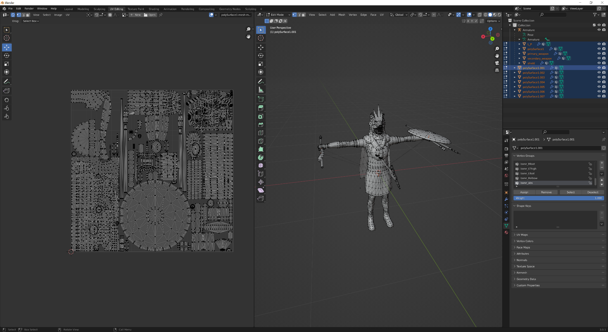
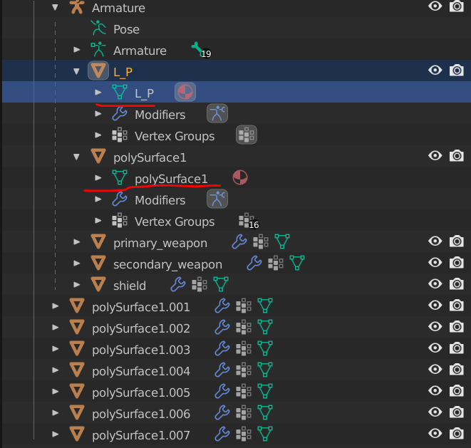

## Creator: **Eduardo** <!-- omit from toc -->

---

# A Guide to Rome Remastered Unit-Making _(with variation models)_ <!-- omit from toc -->

- [Planning](#planning)
- [Making the models](#making-the-models)
- [Making the textures](#making-the-textures)
- [DMB, EDU, and `export_units.txt`](#dmb-edu-and-export_unitstxt)

## Planning

Everything should start with planning. Think about what you want to include in your models, what helmets, shields and all the like. I like to put it on a spreadsheet to easily be able to see what’s in each model and balance things out.



## Making the models

Open IWTE. At the top, click on **Rome Remastered**, then hover the mouse over **RR Units**. Select the **Characters model extraction** option. The program will then ask you to select a packs folder (choose characters/packs in your RR data folder), and a second folder in which to place the extracted models (select one at your convenience).

Then, in the IWTE window, there will appear a list of all lod0 models from the game (it may take a few seconds). Select those relevant (in this case, the models for roman peasant, long shield cavalry, greek peltast, numidian cavalry, mardian archer, mounted noble and scutarii), click **Add** and then **Ok**. The relevant models will appear in the folder you chose previously.

Open Blender. Now, for each different part you want to use, you’ll have to import the respective model, delete the vertices you don’t want, and export it.

_Note: you can do this for every ethnicity, but I recommend only doing it for the caucasian one. It will still work with other ethnicities (example: a black soldier is still possible), just some minor details are different such as nose length._

Here’s an example (for the Long Shield Cavalry Helmet).

Open a new file in Blender, and delete the Camera, Light and Cube. Select **File > Import > Collada (default) (.dae)**. Then select the model you want the part from.



Now, in the top right-hand corner window which lists the armatures and the meshes under them, select the ones you _don’t_ need and press **Delete**. In this example, those are primary_weapon, secondary_weapon and shield. The entire soldier model is polySurface1, which I will not delete. **DO NOT DELETE THE ARMATURE.**

Now, select the mesh you didn’t delete, and go into **Edit Mode** (top left-hand corner, default is **Object Mode**).



Now, use the mouse to select (some of) the vertices you don’t want. In this case, I’m going to keep the head, so I won’t select any of its vertices.


Pressing **Ctrl** and **+** (the one on the numpad, not the one on the regular keyboard; this can be changed in settings in case you don’t have a numpad) for a couple of seconds will recursively select all the vertices tied to the ones you selected, so it is a powerful tool when selecting entire parts.



Then, press **Delete** and select **Vertices**. You may have to repeat these steps as often not all you want to delete is selected, but that should be no issue.



When you have your part ready, go back to **Object Mode**. You can now export your file to `.dae` **(File > Export > Collada (default) (.dae))** and save it at your convenience.

_Remember, not everything needs to be listed in planning. For example, I didn’t include in the spreadsheet the weapons and scabbard, for which I’m using the regular Numidian Cavalry ones for every single model._

Now that you have all the parts ready, open a new Blender file. Import all the parts that you need, **starting with one that is used in all the models** (if you don’t have any, start by importing one that is used in most of them). Import by section, i.e. import all the heads in a row, then all the bodies etc. It will make it easier to identify them next. You should end up with something resembling this:



Select all the Armatures **excluding the first one** and delete them. The meshes under them will remain.

Now you need to make sure that the UV maps are alright (and by this I mean you’ll have to change a lot in them to make them alright). Select any mesh, and click on **UV Editing** at the top. You will automatically go into **Edit Mode**—don’t worry about this, the only way to see/edit the UV maps is in **Edit Mode**. You will notice that in the top right-hand corner, to the left of each mesh name, there is a point.



If you click a point, you are selecting that individual mesh, and only that one will show up in the UV map (the others still exist—they’re just hidden). If you want to display several ones, click one, then click the rest while holding **Ctrl**.

On the top left-hand side of the UV section, there is a symbol with two opposite direction arrows named **UV Sync Selection**. This is not on by default, you have to click it. De-syncing can also be useful in certain situations, we’ll get to that in a bit. But for now keep it on.

You will notice that if you select several meshes the UVs will be overlapping. This is what needs to be avoided.

Start by selecting only the parts you’re using in all models. In the example, these are the scabbard, the swords, the javelins, the shield and l_p (which are the javelins that the soldier has in his left hand). If these are of the same origin model, there should be no issue in not changing their UVs at all—they should not be overlapping. If they’re from different models, they may be overlapping, in which case you need to select the overlapping parts and move them elsewhere. For this, I recommend selecting only the mesh of a given part to easily select that part, then selecting the other meshes you want to adjust it to, then moving the part to a convenient position. The UV section has a list of tools on the left, you will need the move tool a lot and occasionally the scale tool too (though if you can avoid it, don’t downscale parts. That will reduce their detail in the texture). You can also rotate the selected part by hitting **r** and then writing the degree of rotation (usually 90 or 270). In some parts, you’ll notice that when you select it, some vertices of other parts are selected too. This is where de-syncing is useful. If you de-sync, you can select the part again and the other parts’ vertices will not be selected, you can then move it around and when done, re-sync (sometimes you may need to sync and de-sync several times because when de-synced you can only see the parts that you selected when synced, though you can also use the squares as visual reference).

When you have adjusted all the parts from the meshes you’re using on every model, you can start to do it for the other meshes. Though not in a disorderly manner: you should put the parts of self-excluding mesh groups in the same place (it’s fine if they overlap), i.e. you can have the UVs of different heads in the same place for example (this is because you won’t have two heads in the same model—so one of them is going to be deleted, and as such its UV).

At the end of all this messing about with UVs you should see something a little bit like this:



**Now save your Blender file.** And a backup of it.

After you save it, select all the meshes that are common for every model (and only those) and go to **UV > Export UV Layout** (in the UV window, at the top). Choose a convenient location to save the image and **make sure that the "All UVs" option in the top right-hand corner is selected**. Save your image. Then, save the UV of each mesh separately, in the same way. After this is done, go back to **Object Mode**.

Now you'll need to join the correct meshes for each individual model while deleting the other ones for each. To join two meshes, simply select both on the object list, move the mouse pointer to the main window and press **Ctrl + J**. The selection order matters: the two meshes will be joined under the last selected one (which means you should always select the one under the armature if one of them is). To delete a mesh, simply select it and press **Delete**. In some cases you may need to parent meshes to the Armature. To do this select the mesh first, then the armature, move the mouse pointer to the main window, right-click and select **Parent > with Empty Groups**.

To be clear: you have a list of each model and the parts it uses. So for each model you need to go back to the saved Blender file (either opening it again or using **Ctrl + Z** repeatedly), delete the unwanted parts for that specific model, and join the remaining ones under the correct mesh. Remember: the soldier mesh is polySurface1, then there’s primary_weapon, secondary_weapon, shield, and occasionally l_p. After finishing the model, double check their names (remove .001 etc at the end), as well as the vertex groups under each mesh (underlined in the image below).



Then, you can export the model as `.dae`.

After you do this for each model, put the resulting models all in one folder. Open IWTE, go to **Model Files > Cas Models > dae to cas_mesh directory**. Select the folder with your models, then select another folder where the program will place the models in their `.cas` version. It outputs two different files: one has the same name as the `.dae` file, the other one ends in `_lod1`. Use the `_lod1` one, copy it to your characters folder, and the copy it three times as the game needs `model_file_name_lod0.cas`, `model_file_name_lod1.cas`, `model_file_name_lod2.cas`, and `model_file_name_lod3.cas` so rename the copies as such.

_Note: this guide doesn’t support lod making. In the vanilla game files, each lod has a different number of vertices (higher lods have less vertices). This is to make the game run smoothly as there’s no need to have a high poly model when looking at it from a large distance. Thus, having different lods is recommended but not necessary, and at the time of writing there’s no way I know of to automate this process._

## Making the textures

Nice, so the models are all done now. Open paint.net (or GIMP, Photoshop, or any other image editor that supports `.dds` files).

Remember where you saved the UVs of each mesh? Open each one in paint.net. Also open the textures of the models they were originally from, and the relevant pbr textures. Now, for each of those UV maps, you’ll need to copy the texture parts from their original textures to the relevant UV map image—but on a second layer. When all the texture parts are filled in, delete the UV map layer, save as `.dds`, hit **Ctrl + Z** to have the layer back, resize to 512x512
and do the same for the pbr.

You should end up with a lot of separate textures, each corresponding to a part. Now, you can copy the "base" texture (common to all models) and paste it in your characters/textures folder, rename it to your convenience (but remember the `.tga.dds` at the end of the name), and copy it until you have as many textures like that in your folder as the number of models you want (you’ll have to rename the copies as well). Do the same for your pbr textures.

Then, open all of them, and for each model’s texture, paste the parts it has on new layers, and merge all the layers (same for pbr). For example, my first model’s texture will have the texture of the Tunic, while the second will have the one of the breastplate. Make the adjustments you like (ex.: colors, materials), save all the textures, and quit.

## DMB, EDU, and `export_units.txt`

Now for the easy part. Make an entry in the DMB (`descr_model_battle.txt`) for each of your models. Put your texture and
pbr in. Then, in all of the `ethnicity` and `no_variation` lines, put your model. This will mean all the ethnicities will work as the game will apply the skin textures to your model regardless of the little details of nose size etc.

Then, make your EDU (`export_descr_unit.txt`) entry. I recommend copying one from a unit with similar characteristics and changing the values to your liking. The only difference is that in the `soldier` line, where you have something like `soldier numidian_cavalry, 27, 0, 1`, you need to replace it with:

```
soldiers 27, 0, 1
{
    default
    {
        numidian_cavalry_1
        numidian_cavalry_2
        numidian_cavalry_3
        numidian_cavalry_4
        numidian_cavalry_5
        numidian_cavalry_6
    }
}
```

Obviously, those names should be replaced by the names of your entries in the DMB.

Then you can make your `text/export_units.txt` entry do add the name and description of the unit, and you’re set!

_Note: this guide doesn’t cover UI images (unit cards) and recruitment. These are obviously necessary to the creation of new units, but the purpose of this guide is to demonstrate how to make new models from existing parts and make the process of making several models and textures per unit more efficient._
