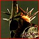

# Krn3ll Guide to add brand new buildings to RTW


## Creator: **Seth Krn3ll**
---

#### Modding area: 
* Buildings (strategic - battle map)
#### Required software: 
* Notepad (or other text editor)
* 3dsMax (or Blender)
* Graphic editor like Photoshop or GIMP
#### Summary: This tutorial explains how to add totally new buildings to the gameplay, both in strategic and battle map modes.

## PREMISE:
Just to be clear: I will NOT explain HOW to model buildings here, just how to add them to the gameplay. Specifically, I will explain step to step how to:
Add new buildings in the building tree of the game
Add their 3d models to the building DB so that they will appear in game

Before starting, keep in mind there are different type of buildings you can add to the game.

**Ambient Buildings** are the simpler ones. They need much less steps then the others. They can’t have recruiting capabilities, they can’t have bonus capabilities, they do not affect campaign game and in battles they are merely obstacles for troops or scenario decorations and they are discussed in this tutorial.

**Game Buildings** are the ones buildable by the players during the game in the settlements. They affect both campaign and battle game, and they are discussed in this tutorial.

**Special buildings** are walls and towers and they are somehow more complicated to manage due to their multiple features. They will not be discussed here, you can check my Wall Modding tutorial there:
--> [Krn3ll's RTW wall modding guide](http://www.twcenter.net/forums/showthread.php?t=439235) 

## 1. ADDING AMBIENT BUILDINGS TO RTW
***
RTW host some buildings which are there just for decoration purposes. They shall indeed be improved to make them fully interactive with the game, host units or force passages in a city map, but those features will not be discussed here. Here I will only explain how to add or modify those models.

Files involved:
* **data\descr_items.db**
* **data\descr_items.txt**
* **data\descr_items\di_*.txt**
* **data\descr_building_battle.txt**
* **data\descr_building_battle\dbb_*_buildings.txt**
* **data\settlement_plans\CITYNAME_plan.txt**

As always, remember to backup those files before changing them, so if things go wrong you can always restore original situation.

We assume you already have the new model you want to add to the game.
Ambient buildings do not need specific text string nor they need to be added to any game related tree.
To have them in the game all you need is to have the models, register them in the game db and place them in the settlement plan where you want them to show up.

Lets say you want your new “MYHOUSE.cas” model in the game.

Put your "MYHOUSE.cas" model in ***data\models_building*** and if it uses new textures put them in ***data\models_building\textures***.

1. Open ***data\descr_items.txt***
Add a line like “include di_MYOWN_buildings.txt”<br />
Save and close<br />

2. Create a file named “di_MYOWN_buildings.txt”<br />
* Type in it:
> ```
> type		MYHOUSE 
> lod
> max_distance	4000.0
> model_rigid	MYHOUSE.cas
> ```
* Save it in data\descr_items\ folder and close

3. Open ***data\descr_building_battle.txt***<br />
Add a line like “include dbb_MYOWN_buildings.txt”<br />
Save and close

4. Create a file named “dbb_MYOWN_buildings.txt”<br />
Type in it:

> ```
>	MYHOUSE
>    {
>        stat_cat large_stone
>        localised_name ambient
>        level
>        {
>            min_health 1
>            battle_stats
>            item MYHOUSE
>            physical_info info_roman_small_temple.cas
>        }
>        transition default_large_stone
>        level
>        {
>            min_health 0
>            battle_stats
>            item roman_rubble_112x64
>            physical_info info_roman_rubble_112x64.cas
>        }
>    }
> ```

Three notes here:
a) The string “physical_info” tells the game which INFO file to be used to define some features of the building. In the example I put the “info_roman_small_temple.cas” but you’ll need to put there one compatible cas model with your own building.
If you are not able to create your own INFO files you’ll have to add here an existing INFO file, so chose one of an item which have similar dimension of your model, or you’ll have weird results in game.
I will discuss how to create the INFO files for your buildings in another tutorial, I’ll post here a link when its ready.
b) The “stat_cat” string tells the game the stats of resistance to damage of your building.
The stats I knew of are:
* small_wooden
* medium_wooden
* small_stone
* medium_stone
* large_stone
c) The “transition” paragraph tells the game what happens if your building is damaged/destroyed during battle. If you want it to be damageable/destroyable you’ll need either to create another model of your building remains when destroyed or to use in such paragraph the model of an existing building remains. If it’s the latter, pick the remains of a model with compatible dimensions. The “level” string is the level of damage of the building. You can add there more then one level of damage along with more then one model of your partially damaged building.
if you don’t want your new building to be damageable/destroyable, use such code:

> ```
> MYHOUSE
>     {
>         stat_cat indestructable
>         localised_name ambient
>         level
>         {
>             min_health 1
>             battle_stats
>             item MYHOUSE.cas
>             physical_info info_roman_small_temple.cas
>         }
>     }
> 	
> ```

Save your “dbb_MYOWN_buildings.txt” into ***data\descr_building_battle\*** folder and close it.

5. Now you have to put your new building in some settlement plan where you’ll see it in game. Go to
**data\settlement_plans\** folder and open the settlement plan of the type where you want your building to show up.

In the *_plan.txt file are defined all the features related to that specific settlement plan type. Look for the “;AMBIENT” comment line, usually there are already some ambient buildings set there. If there’s no one, just add it at the end of the file, BUT be sure to add it INSIDE the last “}” which closes the file.
Add a line like this:
“MYHOUSE, 140, 150, 180.0, 0.0”
This string tells the game to put the model item “MYHOUSE” in that settlement map, at cords x 140 y 150, to rotate it of 180 degrees on his z axis and to have it at 0 meters altitude. You shall have a view of the settlement before deciding those parameters, otherwise your model shall be placed under a hill or collide with other buildings already present in that settlement at such position, or be put on a road and stop the passage of troops.

If you are just replacing some existing models with your one, then simply replace their names with your model’s name and use their original coordinates as they are in the settlement_plan.


Once all those tasks are done, save all, backup your descr_items.db file, rename or delete it and start the game. Game will freeze at starting screen or show errors, just ctrl-alt-canc, kill it, restart it. If you did everything correctly, You should have your buildings in the game.


## 2. ADDING GAME BUILDINGS TO RTW
***

Now, there are about 1 million chances you’ll get errors. Trying to write a troubleshooting on this process is simply ridiculous, but let me share a few recurring problems:

a) Game just does not load, no error messages – something is wrong in descr_settlement_plan.txt usually a not closed bracket or something similar.
Game loads, you enter the campaign, no traces of your buildings in game – something wrong written in descr_items.txt or in descr_building_battle.txt
Check if the game created the monolith1 and 2 items in data\items\ folder.
b) Game loads, but when you go in tactical view, loading freezes – you missed adding the textures.
c) All works, but your buildings are missing sides or show weird colors – 50% chances that the exporting procedure did not worked very well. It happens, export them again – no need to rebuild the db. The other 50% chances are – let me be rude – that you are a poor modeler.


Have fun.<br />
Seth Krn3ll

***
added by: **Dagovax**

*[Original post](http://www.twcenter.net/forums/showthread.php?437930-Krn3ll-Guide-to-add-brand-new-buildings-to-RTW-1-5)*<br />


